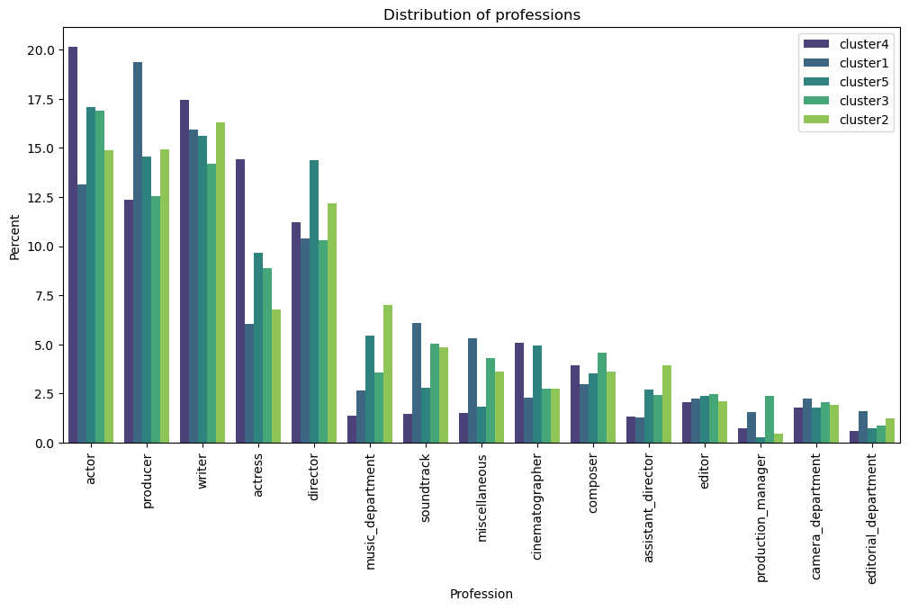
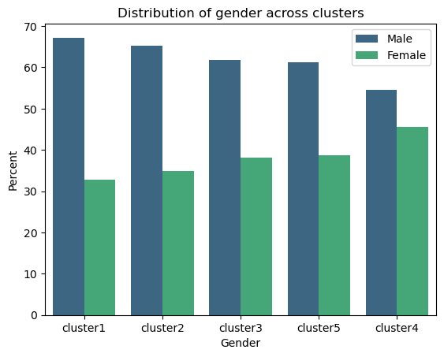
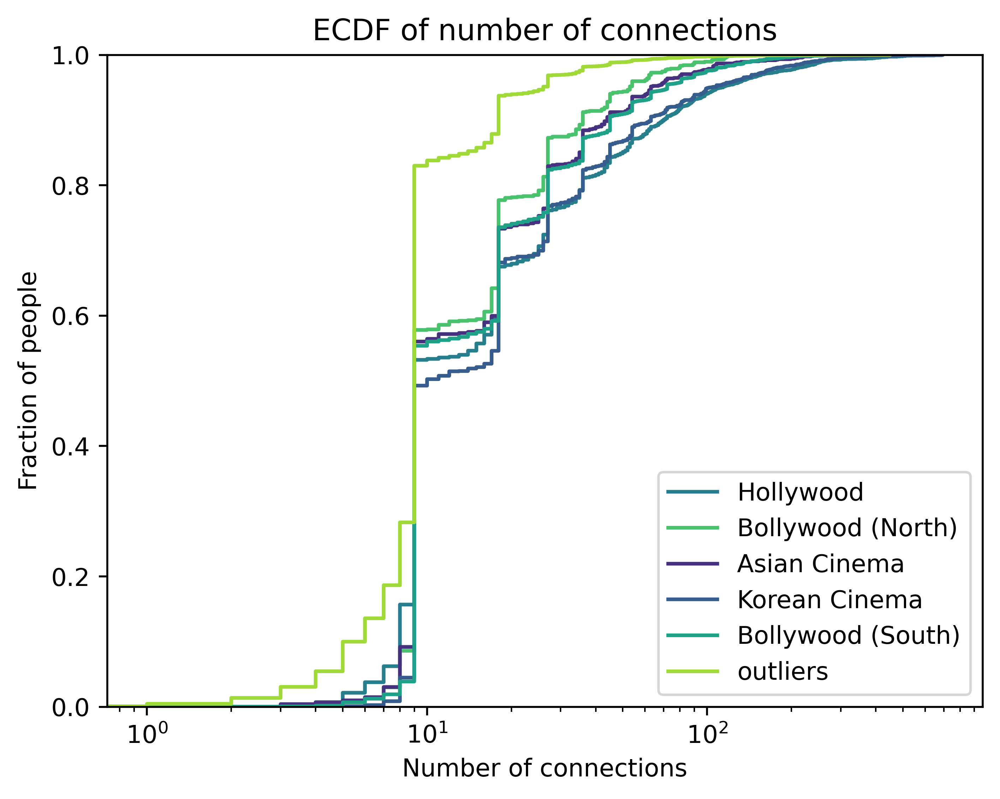
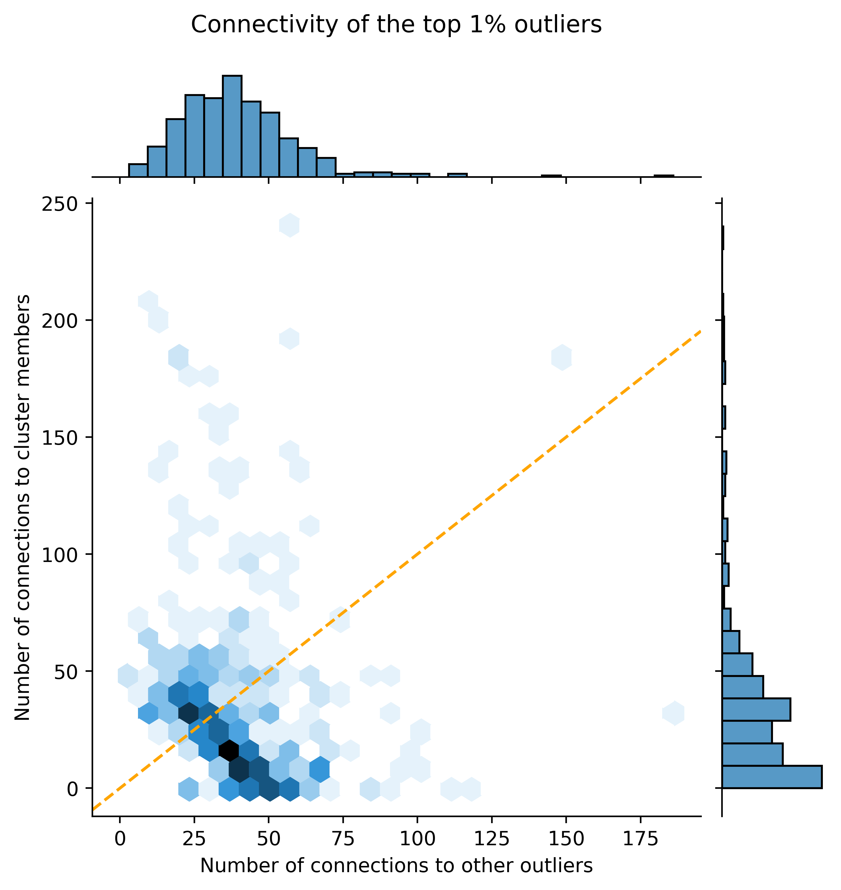
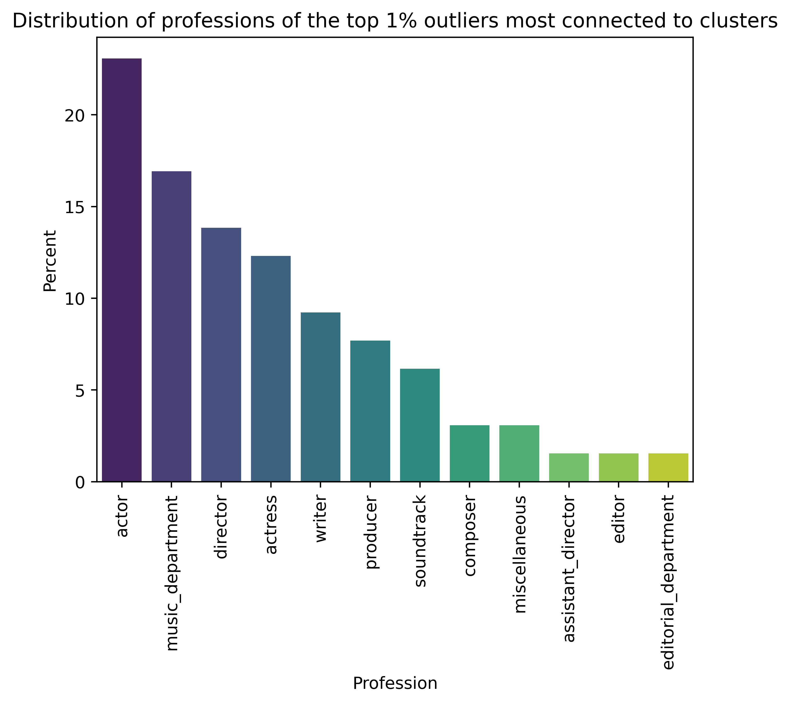
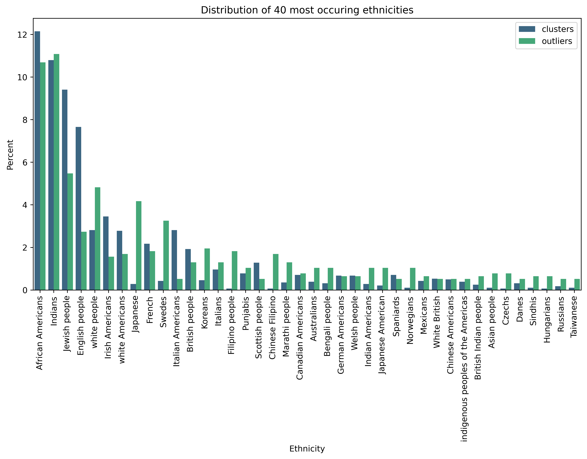

###### The famous selfie shared by Ellen DeGeneres with actors, front row from left, Jared Leto, Jennifer Lawrence, Meryl Streep, Ellen DeGeneres, Bradley Cooper, Peter Nyongo Jr. and, second row, from left, Channing Tatum, Julia Roberts, Kevin Spacey, Brad Pitt, Lupita Nyongo and Angelina Jolie during the Oscars 2014 (AP Photo/Ellen DeGeneres) (AP)

_"It's Not What You Know. It's Who You Know"_

Everyone has heard this quote or experienced it first hand. It is no secret that social network has a large impact on career and personal life.

Even going further, we could argue that this quote is created by someone from the movie industry. In this project we analyzed the
social network of people who work in cinema. We used the [CMU Movie Summary Corpus](https://www.cs.cmu.edu/~ark/personas/) and [IMDb](https://www.imdb.com/interfaces/) datasets to do our analysis.

We analyzed the large social network by dividing into clusters and then we zoomed into the significant clusters to further investigate the people who know each other, why these clusters exist and who are the key people that bridge different clusters. For each cluster, we looked at their common attributes and tied them into real-life clusters such as Bollywood, Hollywood etc.

# The Data We Worked With

We merged IMDb dataset into our given dataset to have more entries and features such as ethnicity which we will use in the later stages. Since we are investigating the connections between people, we wanted to minimize the matches between people who would not be able to meet in real life due to the year they were active. To choose the best time period, we looked at the number of movies per year.

As seen from the plot, 1996-2011 (both inclusive) period has the highest number of movies. One may ask why didn't we just count the number of rows and select a period? The answer will be clear after understaind what are we trying to visualize with the dataset.

## How to visualize?

First and foremost, we are interested in how people are connected to each other. Building a network graph is the best way to illustrate this. Thus, we need to define the nodes and edges of the graph. Nodes represent people and an undirected edge between two people exists if they worked in the same movie. To make our network less sparse, we made our initial period decision on movie count. Intiutively, when two people work with each other more, they build a stronger connection. To reflect that, our edges are weighted by common number of movies.

Now, lets build our graph to visualize what we talked about.

We turned our attention to the Fruchterman-Reingold force-directed algorithm, which produces beautiful networks. Those graphs emphasis the position of the nodes, assuring as few edge crossings and distance disparities as possible. The algorithm works similarly to interaction between attractive and repelling forces. The edges between nodes are the springs which pull closer, and the nodes themselves are the object exercing push.

    

        
    

# Clustering

We see some natural clusterings occur, so we run a clustering algorithm to understand the reason. We used OPTICS clustering algorithm, which has foundations from DBSCAN but allows rejecting clusters under a certain size. We choose to reject clusters under 400 people to focus on more generalizable clusters.

For simplify the graph, we only show the names of people who were in more than 24 movies.

    

        
    

Looking at the cluster graph, we observe 5 large clusters (differentiated by color) and some outliers. We are curious whether these clusters represent or resemble real clusters such as Hollywood, Bollywood and so on. The name of these movie industries come from where they are located. For example Hollywood is a neighbourhood in Los Angeles, California USA and Bollywood gets its name from its birthplace, Bombay (now Mumbai), India. Since movies are generally catered towards the local audience, the native languages are used. This also means that majority the actors, directors and writers are from that nationality or native speakers of the language.

From this analogy, we made an assumption that ethnicity data will reveal us which movie industry they resemble. The ethnicity information comes from IMDb dataset, thus we have NaN values for the people who are in the CMU dataset but not in the IMDb dataset. But we can assume that the distribution of the people with ethnicities (although a small percentage) will be inline with the distribution if CMU dataset had the feature too.

## Diving into clusters

Let's plot the etnicity distribution of each cluster. We only considered non NaN values for the plotting. Note that the results of the clusters heavily depend on the algorithm and the parameters we used.

Cluster 1: We can see that Americans with different descents are observed the most with ~34%. Thus we can say that this is the cluster that represents Hollywood.

Cluster 2: This cluster represents Bollywood with 60%. Punjabis who live in eastern Pakistan and northwestern India are also considered very active in Bollywood cinema.

Cluster 3: This cluster is rather interesting. It has the equal percentage of Japanese and Chinese Americans. Then we have 2 more ethnicities with Asian descent. So we can call this "Asian Cinema".

Cluster 4: This one is Korean Cinema with more than 80% Koreans in it.

Cluster 5: We also see Indians as a majority ethnicity similarly to Cluster 2. The difference is the second biggest ethnicity, Tamils are from India (Southern regions) and Sri Lanka. So this is also Bollywood.

Since we named the clusters, lets look further into the features of the clusters.

Our dataset has people with different professions such as actor, actresses, editors and so on. Let's take a look.

Our professions data comes from IMDb, and is generated from the credits.
If we focus on the professions that have a higher percentage, they being actors, actresses, producers and directors, we see that all clusters have similar distribution with 5-10% difference.

Interestingly, we have much more actors than actresses with a large difference. According to New York Film Academy, for one actress there are 2.25 actors. Does this inequality happen also behind the scenes? Lets look at the general gender percentage.

Unfortunately, we see a deeper cut between male and female employment. Korean Cinema seems to be the most inclusive one with only a 10% difference. Whereas Hollwood has almost 30% difference, meaning there is one female per male. And this is very recent times!

# Outside the Clusters

## Outliers

Before diving into the people, let's look at more data.
As we saw in the clustering part, we have discovered five clusters in our network and, in addition, more than half (53.4%) of our nodes are outliers. We define outliers as people who are not placed in a cluster. The reason they are outliers mainly caused by working in movies from different clusters.

Despite us classifying them as "outliers", these people are of course still connected to the graph. Let us compare the connectivity between each clusters and outliers.

We see that connectivity is heavy tailed. Additionally, outliers are less well connected than any of the clusters. Interestingly, the distributions are very similar.

As the connectivity distribution is heavy-tailed, we consider the top 1% most connected outliers for our subsequent analysis. Indeed, it makes sense that outliers are less connected on average than cluster members, otherwise they would have formed a cluster with other outliers, or joined another cluster. For this reason, the most connected outliers are what is interesting. They are the ones that might be, for example, bridges between clusters. Equally well connected to both, which lead them to not be assigned to either of them.

But how well these 1% is connected to the others?

We see that even the top 1% of most connected outliers are not that well connected, with 74.7% of them having less than 100 connections. We see that some of them are truly isolated, but most of them are close to clusters.

Let's look at who are these 1% outliers.

The plot shows that actors, music department directors and actresses are more likely to work globally. We can explain the lack of people with behind-the-scenes professions as outliers by saying that people with these professions are hired by film studios and they typically operate in their own countries.

Now let's look at the ethnicity distribution of outliers. To compare, we also plotted the ethnicities of people with clusters.

We observe that people with English as their native language are have clusters, but the majority of outliers are English native speakers. It makes sence since there are many movie industries which are located in English speaking countries.

We see some ethnicities located in India and neighbouring countries such as Punjabis, Marathis, Bengali adn Sindhis who are outliers. This could indicate that their native movie industries are not big enough to be standalone. Hence their members often collaborate with people from other movie industry hotspots such as Bollwood.

## Key People

We define the key people as outliers who have many connections to clusters or other outliers. Let's look at two notable people.

- A.R. Rahman, an Indian music composer. He is mainly known in the West for his work on Slumdog Milionaire, which he won 2 Oscars for. He worked on 52 movies, almost exclusively from India. Due to his popularity there, he is very well connected to the two India related clusters (112 and 90 connections respectively), as well as to other outliers (225) connections, due to his involvement in music videos and tv series.

- Takashi Miike, a Japanese director most known for 13 Assassins. He directed 33 movies, and many more low budget TV series. He has very little connected to clusters (5 connections to cluster 0, 43 connections to cluster 2) compared to his 250 connections to other outliers.

# Conclusion
